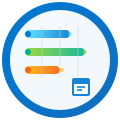

  
  <h1>ガントチャートプロジェクト管理</h1>
  
<strong>Power Apps Code Apps</strong>

  
  

    
    
    
    
  

---

> [!Note]
> 利用した感想はぜひ[ギークフジワラのX](https://x.com/geekfujiwara/status/1986705800119861480)までご投稿お願い致します！
>
> また、インストール方法は本ページの末尾をご確認ください。

## 概要
ITシステム導入プロジェクト用のガントチャート管理アプリです。[geekfujiwara/CodeAppsDevelopmentStandard](https://github.com/geekfujiwara/CodeAppsDevelopmentStandard) に準拠して開発されています。

以下のように動作します。

https://github.com/user-attachments/assets/99878096-e832-402b-82b2-9db51adac7c4

## 特長

- **直感的なガントチャート操作**: タスクの開始日・終了日・進捗率を色分けしたバーで把握し、ドラッグ＆ドロップで瞬時にスケジュール調整が可能。
- **プロジェクトとタスクを一体管理**: プロジェクト作成・編集、タスクの詳細管理、担当者の割り当てまでブラウザ内モーダルでシームレスに完結。
- **CSV一括インポート/エクスポート**: Dataverse との連携を前提に、事前バリデーション付きでタスクの大量登録・更新・削除を安全に実行。
- **Power Platform との緊密な連携**: Power Apps Code Apps SDK を採用し、Dataverse の実データを扱いながらローカル開発と本番運用を両立。
- **モダンでアクセシブルなUI**: ダークモード、レスポンシブ対応、shadcn/ui ベースのコンポーネントにより、どのデバイスでも快適な操作体験を提供。

## 全体機能の概要

| 画面/モジュール | 概要 | 主な要素 |
|-----------------|------|----------|
| ダッシュボード | プロジェクト横断の進捗サマリと重要指標をハイライト | 統計カード、最近の更新、ショートカット |
| ガントチャート | プロジェクト単位のタスクタイムラインを表示・編集 | タスクバー、進捗指標カード、タスク詳細トリガー |
| Myタスク | 担当者視点でのタスク一覧とステータス変更 | ステータスフィルタ、進捗変更操作、詳細モーダル |
| CSV一括タスク操作 | CSV の読み込み・検証・一括処理を行うモーダル | テンプレートDL、プレビュー編集、処理結果フィードバック |
| サイドメニュー/検索 | プロジェクト/担当者のナビゲーションとフィルタリング | プロジェクトリスト、担当者検索、アクションリンク |

## 各機能の利用方法

### ダッシュボード
1. サイドメニューから「ダッシュボード」を選択すると統計ビューが表示されます。
2. プロジェクトカードをクリックすると、該当プロジェクトのガント画面へ遷移します。
3. 「すべてのプロジェクトを見る」「自分のタスクを確認する」などのショートカットで主要画面へ移動できます。

### ガントチャート
1. プロジェクトを選択するとガント画面が開き、タスクの期間と進捗がバーで表示されます。
2. タスクバーをドラッグして開始日・終了日を調整すると、変更内容が即座に反映されます。
3. タスク名をクリックするとモーダルが開き、詳細編集やステータス更新が行えます。
4. 画面右上の「新規タスク」ボタンから新しいタスクを追加できます。

### Myタスク
1. サイドメニューの担当者検索から自分の名前を選択するか、「マイタスク」メニューを開きます。
2. 担当タスクの一覧が表示され、ステータス変更や詳細表示が可能です。
3. ステータスを「完了」へ変更すると進捗率が自動的に 100% へ更新されます。

### CSV一括タスク操作
1. ガント画面右上の「CSVアップロード」をクリックし、モーダルを開きます。
2. 「テンプレートをダウンロード」で最新の CSV フォーマットを取得し、必要なタスク情報を入力します。
3. CSV ファイルをアップロードすると自動でバリデーションが実行され、エラー行はプレビュー上で編集できます。
4. エラーを解消したら「一括処理を実行」を押すと、Dataverse へ CREATE/UPDATE/DELETE が送信され、結果が表示されます。

### プロジェクト・担当者ナビゲーション
1. サイドメニューのプロジェクト一覧から対象を選択すると、そのプロジェクトのガント画面へ移動します。
2. 担当者検索欄から名前で絞り込み、「担当者一覧」セクションで該当者のタスクを開けます。

## ライセンス
MIT License

## インストール方法

### 環境で Code Apps を有効にする

Power Platform 管理センター > 環境 > 機能 > 設定 に、Code Apps を有効にする設定項目が現れています。こちらを有効にします。

開発環境を整える場合についての詳細も確認したい場合こちらで紹介しています。

https://www.geekfujiwara.com/tech/powerplatform/7352/

### ソリューションをインストールする

ソリューションにてインストールが可能です。

[リリースよりソリューションを入手し](https://github.com/geekfujiwara/GanttChartManager/releases)、Power Apps 作成者ポータルにてインポートします。

入手したら **アプリ** から実行します。

実行すると必要な接続を作成します。

実行できるようになりました。

## 開発標準
本プロジェクトは [geekfujiwara/CodeAppsDevelopmentStandard](https://github.com/geekfujiwara/CodeAppsDevelopmentStandard) に準拠して開発されています。

---

**Power Apps Code Apps** で構築された Microsoft 公式パターン準拠のプロジェクト管理アプリケーションです。
